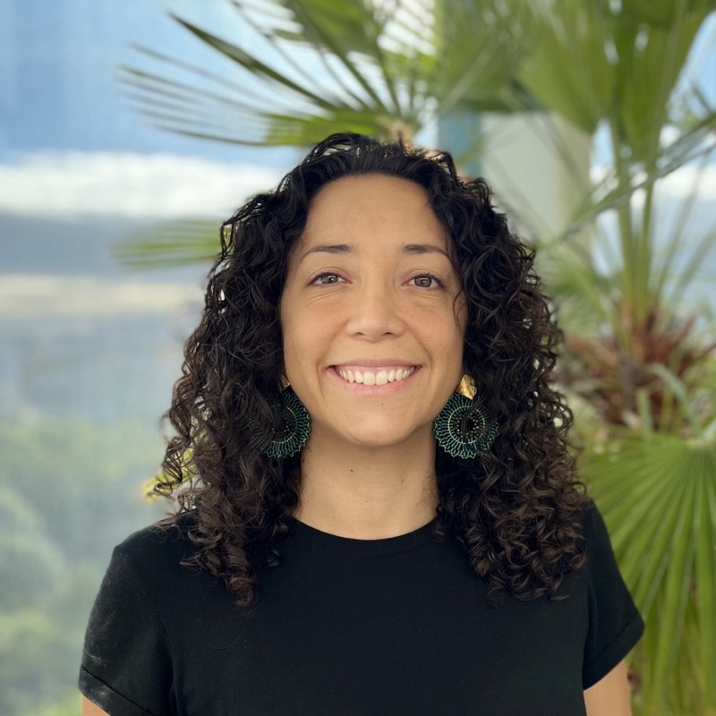

::: {.profile-grid}
{.profile-photo fig-alt="Stephanie Vargas Aguilar"}

::: {.profile-text}

Stephanie Vargas Aguilar

::: {.affiliation}
Postdoctoral fellow · Department of Molecular Biology · UT Southwestern Medical Center
:::

I study how the immune system shapes the regenerating heart. In the laboratory of
Eric Olson I work on the PD-1/PD-L1 pathway and the immunosuppressive environment
that newborn hearts require in order to regenerate after injury — work supported
since 2025 by an American Heart Association Career Development Award.

Before Dallas I completed my PhD with Michael Sieweke at the Centre d'Immunologie
de Marseille-Luminy and the Max Delbrück Center in Berlin, on the molecular
mechanisms that let tissue-resident macrophages renew themselves, and a Diploma in
Molecular Medicine at the University of Freiburg.

::: {.contact-row}
<a href="mailto:stephanie.vargasaguilar@utsouthwestern.edu"><i class="bi bi-envelope"></i> Email</a>
<a href="files/vargas-aguilar_cv.pdf"><i class="bi bi-file-earmark-person"></i> CV</a>
:::
:::
:::
