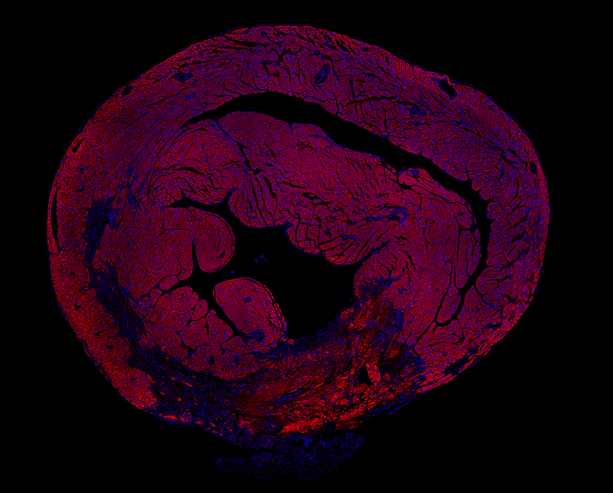

::: {.hero}
::: {.hero-inner}
[Stephanie Vargas Aguilar]{.hero-name}

[Postdoctoral fellow · Olson Lab]{.hero-role}

[UT Southwestern Medical Center]{.hero-affiliation}

[How does the immune system heal the heart?]{.hero-question role="heading" aria-level="1"}

[Lessons from Newborns.]{.hero-subtitle}
:::

```{=html}
<div class="hero-contact" role="complementary" aria-labelledby="hero-contact-title">
  <p id="hero-contact-title" class="hero-contact-title">Contact &amp; profiles</p>
  <!-- Keep profile destinations in sync with contact.qmd. -->
  <ul class="hero-contact-links">
    <li><a href="mailto:stephanie.vargasaguilar@utsouthwestern.edu" title="stephanie.vargasaguilar@utsouthwestern.edu"><i class="bi bi-envelope" aria-hidden="true"></i><span>Email</span></a></li>
    <li><a href="https://scholar.google.com/citations?hl=en&amp;user=LvXfnqUAAAAJ"><i class="bi bi-mortarboard" aria-hidden="true"></i><span>Google Scholar</span></a></li>
    <li><a href="https://orcid.org/0000-0002-6584-0209"><i class="bi bi-person-badge" aria-hidden="true"></i><span>ORCID</span></a></li>
    <li><a href="https://www.linkedin.com/in/stephanievargasaguilar"><i class="bi bi-linkedin" aria-hidden="true"></i><span>LinkedIn</span></a></li>
  </ul>
</div>
```

::: {.hero-visual}
```{=html}
<picture>
  <source type="image/webp" srcset="images/heart-960.webp 960w, images/heart.webp 1884w" sizes="(min-aspect-ratio: 1884/1516) 88vw, 109svh">
  
</picture>
```
:::
:::
